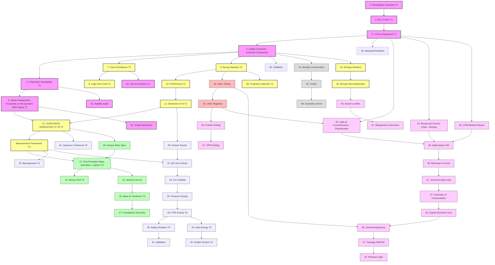

# Recognition Science: The Dependency Graph (DAG)

This document maps the logical dependencies between the core papers of Recognition Science. It demonstrates that the theory is not a linear list but a branching tree rooted in a single foundational stack.

## How to Read This DAG

1.  **The Spine (Papers 1–12):** This is the mandatory path. You cannot understand the mass of the Electron (Paper 13) or the structure of LNAL (Paper 18) without the **Ledger (4)** and **J-Cost (3)**.
2.  **The Branching Point (Paper 12):** Paper 12 (*Derivation of Constants*) is the "Grand Central Station." Once you accept the derivation of $\alpha$, $G$, and $\hbar$, you can choose your adventure:
    *   **Physicists** go left to **Particles** or **Gravity**.
    *   **Engineers** go center to the **LNAL** stack.
    *   **Philosophers/Biologists** go right to **Consciousness** and **Ethics**.
3.  **Priority Tags:** Nodes marked \texttt{T1}, \texttt{T2}, \texttt{T3} are the publish-first tiers.
4.  **Cross-Dependencies:**
    *   Note that **Protein Folding (26)** depends on **LNAL Registers (19)**. You can't do the biology without the machine code.
    *   **CPM Gravity (29)** depends on the **CPM Method (37)** (conceptually), showing how the math tools are reused.

## Mermaid Diagram

You can view this diagram using any Mermaid-compatible viewer (like the Mermaid Preview extension in VS Code, or online at mermaid.live).

graph TD
    %% --- STYLES ---
    classDef foundation fill:#f9f,stroke:#333,stroke-width:2px;
    classDef spine fill:#ff9,stroke:#333,stroke-width:2px;
    classDef particles fill:#bfb,stroke:#333,stroke-width:1px;
    classDef lnal fill:#fbb,stroke:#333,stroke-width:1px;
    classDef gravity fill:#eef,stroke:#333,stroke-width:1px;
    classDef consciousness fill:#fcf,stroke:#333,stroke-width:1px;
    classDef ethics fill:#ddd,stroke:#333,stroke-width:1px;

    %% --- THE ROOT (Foundation) ---
    P1[1. Recognition Geometry T1] --> P2[2. RCL Primer T1]
    P2 --> P3[3. J-Cost Uniqueness T1]
    P3 --> P4[4. Ledger Dynamics - Coherent Comparison]
    P4 --> P5[5. D'Alembert Inevitability T1]
    P5 --> P6[6. Model-Independent Exclusivity on the Quotient State Space T1]
    
    %% --- THE STRUCTURE (Ontology) ---
    P4 --> P7[7. Cost of Existence T2]
    P7 --> P8[8. Logic from Cost T2]
    P4 --> P9[9. Recog Operator T2]
    P9 --> P10[10. Phi/Penrose T2]
    P10 --> P11[11. Dimension D=3 T2]

    %% --- THE WAIST (The Big Unlock) ---
    P6 & P11 --> P12[12. CONSTANTS DERIVATION T1-T8 T2]
    P12 --> P50[Measurement Framework T2]
    class P1,P2,P3,P4,P5,P6 foundation;
    class P7,P8,P9,P10,P11,P12,P50 spine;

    %% --- TRACK A: PARTICLE PHYSICS ---
    P50 --> P13[13. First-Principles Mass Derivation: Leptons T3]
    P13 --> P14[14. Mixing CKM T3]
    P13 --> P15[15. Neutrino No-Go]
    P15 --> P16[16. Mass III: Neutrinos T3]
    P16 --> P17[17. Foundations Summary]
    class P13,P14,P15,P16,P17 particles;

    %% --- TRACK B: COMPUTATION (LNAL) ---
    P9 --> P18[18. LNAL Theory]
    P18 --> P19[19. LNAL Registers]
    class P18,P19 lnal;

    %% --- TRACK D: GRAVITY & COSMOLOGY ---
    P50 --> P23[23. Baryogenesis T3]
    P50 --> P24[24. QG Zero-Param]
    P12 --> P61[61. Quantum Coherence T3]
    P24 --> P25[25. ILG Scaffold]
    P25 --> P28[28. Pressure Gravity]
    P28 --> P29[29. CPM Gravity T3]
    P29 --> P30[30. Galaxy Rotation T3]
    P30 --> P31[31. Validation]
    P29 --> P32[32. Dark Energy T3]
    P32 --> P33[33. Hubble Tension T3]
    class P23,P24,P25,P28,P29,P30,P31,P32,P33,P61 gravity;

    %% --- TRACK E: MATH ---
    P3 --> P34[34. Riemann/Fredholm]
    P4 --> P36[36. Goldbach]

    %% --- TRACK F: LIFE & CONSCIOUSNESS ---
    P19 --> P26[26. Protein Folding]
    P26 --> P27[27. CPM Folding]
    
    P19 & P3 --> P43[43. Light as Consciousness - Classification]
    P3 --> P63[63. Reciprocal Convex Costs - Entropy]
    P3 --> P64[64. CPM Method Closure]
    P64 --> P39[39. Optimization Ref]
    P63 --> P39
    P43 --> P39
    P39 --> P40[40. Meaning is Forced]
    P40 --> P41[41. Universal Light Lang]
    
    P41 --> P65[57. Geometry of Transmutation]
    P65 --> P62[62. Qualia Geometry ULQ]
    P62 --> P46[46. Geometrodynamics]
    P18 --> P46
    P46 --> P47[47. Topology Self-Ref]
    P47 --> P42[42. Phantom Light]
    class P26,P27,P39,P40,P41,P42,P43,P46,P47,P62,P63,P64,P65 consciousness;

    %% --- TRACK G: ETHICS ---
    P4 --> P44[44. Morality Conservation]
    P44 --> P45[45. Virtues]
    P45 --> P48[48. Geometry of Evil]
    class P44,P45,P48 ethics;

## Extended DAG

